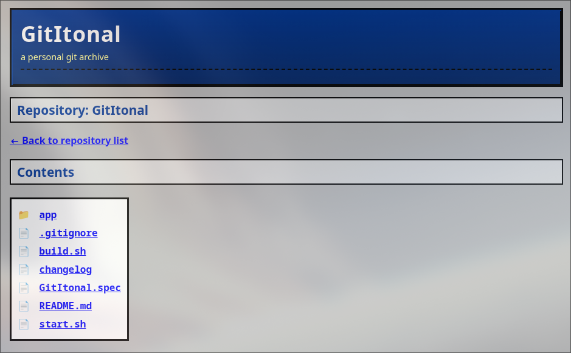

# GitItonal

GitItonal is a small, personal project for browsing my own Git repositories
stored on a private server.

I’m building this mainly as a way to understand Git better and to have a simple,
self-controlled place where my code lives and can be viewed without relying on
external platforms. Repositories are accessed normally over SSH; this project
only provides a lightweight web view for commits, files, and history.
